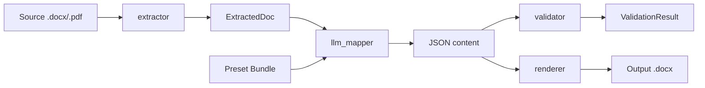

# Pipeline

The 5-stage flow from raw document to normalized output.

## Stages

### 1. `extractor`

Reads `.docx` or `.pdf`. Returns `ExtractedDoc(text, paragraphs, tables, header_fields)`.

- `.docx`: uses `python-docx`
- `.pdf`: uses `pdfplumber`
- OCR for scanned PDFs is on the [roadmap](https://github.com/Luizhcrs/template-engine/blob/main/ROADMAP.md)

### 2. `preset_creator`

**Runs once per template.** Analyzes the template + 1-5 gold docs and generates:

- `pattern.md` — natural-language description of detected pattern
- `schema.json` — JSON Schema for downstream content extraction
- `render_ops.yaml` — deterministic operations to apply on the template
- `validation.yaml` — critical tokens regex + required sections

### 3. `llm_mapper`

For each source document: builds prompt with `pattern.md` + few-shot gold docs + `schema.json`, calls the LLM, returns structured JSON.

### 4. `validator`

Verifies:

- All critical tokens from source appear in extracted content (regex)
- All required sections are populated

Returns `ValidationResult` with counts and missing items.

### 5. `renderer`

Applies operations from `render_ops.yaml` against the template + JSON content. **No LLM involved.** Pure determinism.

## Why this split

**LLMs are non-deterministic.** Same input may yield slightly different outputs. So content extraction (where determinism is OK) lives in the LLM stage; visual formatting (where determinism is required) lives in the renderer.

This means: switching LLMs (Gemini → GPT → Claude) does not change visual output, only the extraction quality.
