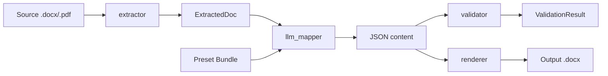

# Pipeline

Fluxo de 5 etapas, do documento bruto à saída normalizada.

## Etapas

### 1. `extractor`

Lê `.docx` ou `.pdf`. Retorna `ExtractedDoc(text, paragraphs, tables, header_fields)`.

- `.docx`: usa `python-docx`
- `.pdf`: usa `pdfplumber`
- OCR pra PDFs escaneados está no [roadmap](https://github.com/Luizhcrs/template-engine/blob/main/ROADMAP.md)

### 2. `preset_creator`

**Roda uma vez por template.** Analisa o template + 1-5 gold docs e gera:

- `pattern.md` — descrição em linguagem natural do padrão detectado
- `schema.json` — JSON Schema pra extração posterior de conteúdo
- `render_ops.yaml` — operações determinísticas aplicadas ao template
- `validation.yaml` — regex de tokens críticos + seções obrigatórias

### 3. `llm_mapper`

Pra cada source: monta prompt com `pattern.md` + gold docs few-shot + `schema.json`, chama o LLM, retorna JSON estruturado.

### 4. `validator`

Verifica:

- Todos tokens críticos do source aparecem no conteúdo extraído (regex)
- Todas seções obrigatórias foram preenchidas

Retorna `ValidationResult` com contagens e itens faltantes.

### 5. `renderer`

Aplica operações de `render_ops.yaml` contra o template + JSON. **Sem LLM envolvido.** Determinismo puro.

## Por que essa separação

**LLMs são não-determinísticos.** Mesmo input pode gerar saídas levemente diferentes. Então a extração de conteúdo (onde determinismo é OK) vive no estágio do LLM; formatação visual (onde determinismo é obrigatório) vive no renderer.

Resultado: trocar de LLM (Gemini → GPT → Claude) não muda saída visual, apenas qualidade da extração.
