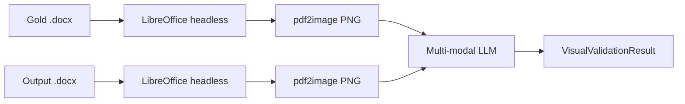

# Visual validation

Compare a rendered `.docx` against a gold reference document using a multi-modal LLM. Returns a 0-1 score plus categorized issues (alignment, spacing, typography, section order, other).

The standard `validator` checks **content** (critical tokens + section coverage). Visual validation checks **layout** — what the standard validator can't see.

## Pipeline



## Requirements

- **LibreOffice** on `PATH` (`soffice` or `libreoffice` binary)
  - Linux: `apt install libreoffice`
  - macOS: `brew install libreoffice`
  - Windows: download from libreoffice.org and add to `PATH`
- `template-engine[visual]` extra (`pdf2image` + `pillow`)
- A multi-modal provider (`GeminiVisionProvider` ships in `[gemini]` extra)

```bash
pip install "template-engine[gemini,visual]"
```

## Quickstart

### Programmatic

```python
import asyncio
from pathlib import Path
from engine import validate_visual
from engine.llm.gemini_vision import GeminiVisionProvider

async def main():
    llm = GeminiVisionProvider(api_key="AIza...")
    result = await validate_visual(
        gold_path=Path("gold.docx"),
        output_path=Path("out.docx"),
        llm=llm,
    )
    print(f"Score: {result.score:.2f}")
    print(f"Summary: {result.summary}")
    for issue in result.issues:
        print(f"  [{issue.severity}] {issue.category}: {issue.description}")

asyncio.run(main())
```

### CLI

```bash
template-engine visual-validate gold.docx out.docx \
    --api-key "$GEMINI_API_KEY" \
    --keep-images ./visual-debug/
```

Output:

```
Visual provider: gemini-vision (gemini-2.5-flash)
+--- Visual validation ----+
| Score: 0.85              |
| Issues: 2 (high=0)       |
|                          |
| Mostly aligned, ...      |
+--------------------------+
+----------+-----------+-------------------------------+
| Severity | Category  | Description                   |
+----------+-----------+-------------------------------+
| medium   | spacing   | Section 2 has extra blank ... |
| low      | typography| Heading uses regular weight ...|
+----------+-----------+-------------------------------+
```

## Result structure

```python
@dataclass(frozen=True)
class VisualValidationResult:
    score: float                    # 0.0-1.0
    issues: list[VisualIssue]
    summary: str                    # 1-2 sentences from the LLM
    gold_image: Path                # rendered PNG (kept for inspection)
    output_image: Path
    raw_response: dict              # full LLM JSON (escape hatch)


@dataclass(frozen=True)
class VisualIssue:
    category: Literal["alignment", "spacing", "typography", "section_order", "other"]
    severity: Literal["low", "medium", "high"]
    description: str
```

## Helper: render to PNG

For thumbnails or pipelines that need raster images of `.docx` files:

```python
from engine import docx_to_png
png_path = docx_to_png(Path("doc.docx"), out_dir=Path("./thumbs"), dpi=200)
```

## Cost considerations

Each call sends 2 images to the LLM. At Gemini free tier, vision quota covers ~50 calls/day. For higher volume:

- Use `keep_images_dir` to cache PNGs and avoid re-rendering on retries
- Eval suites: budget ~2 calls per source document
- For large eval runs, consider `[anthropic]` (Claude vision) — currently planned for v0.3+

## Limitations

- Compares **first page only** (configurable in v0.3)
- Schema covers 5 issue categories; specialized rubrics need a custom prompt + schema
- LibreOffice rendering may not match Microsoft Word exactly (fonts, line breaks)
- Gemini vision sometimes refuses on filter; raises `LLMError`

## Related

- [Pipeline](pipeline.md) — full conversion flow
- [Render ops](render-ops.md) — deterministic operations the renderer applies
- [Providers overview](../providers/index.md)
