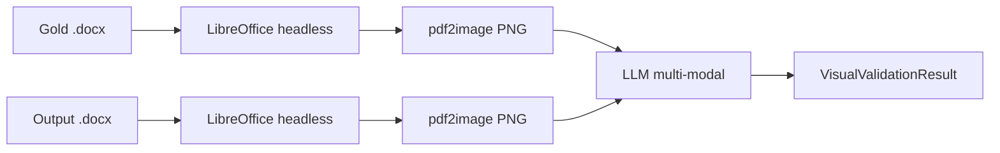

# Validação visual

Compara um `.docx` renderizado contra um documento gold de referência usando LLM multi-modal. Retorna score 0-1 + issues categorizados (alinhamento, espaçamento, tipografia, ordem de seções, outros).

O `validator` padrão checa **conteúdo** (tokens críticos + cobertura de seções). Validação visual checa **layout** — o que o validator padrão não enxerga.

## Pipeline



## Requisitos

- **LibreOffice** no `PATH` (binário `soffice` ou `libreoffice`)
  - Linux: `apt install libreoffice`
  - macOS: `brew install libreoffice`
  - Windows: baixar em libreoffice.org e adicionar ao `PATH`
- Extra `template-engine[visual]` (`pdf2image` + `pillow`)
- Provider multi-modal (`GeminiVisionProvider` vem no extra `[gemini]`)

```bash
pip install "template-engine[gemini,visual]"
```

## Quickstart

### Programático

```python
import asyncio
from pathlib import Path
from engine import validate_visual
from engine.llm.gemini_vision import GeminiVisionProvider

async def main():
    llm = GeminiVisionProvider(api_key="AIza...")
    result = await validate_visual(
        gold_path=Path("gold.docx"),
        output_path=Path("out.docx"),
        llm=llm,
    )
    print(f"Score: {result.score:.2f}")
    print(f"Resumo: {result.summary}")
    for issue in result.issues:
        print(f"  [{issue.severity}] {issue.category}: {issue.description}")

asyncio.run(main())
```

### CLI

```bash
template-engine visual-validate gold.docx out.docx \
    --api-key "$GEMINI_API_KEY" \
    --keep-images ./visual-debug/
```

## Estrutura do resultado

```python
@dataclass(frozen=True)
class VisualValidationResult:
    score: float                    # 0.0-1.0
    issues: list[VisualIssue]
    summary: str                    # 1-2 frases do LLM
    gold_image: Path                # PNG renderizado (preservado pra inspeção)
    output_image: Path
    raw_response: dict              # JSON cru do LLM (escape hatch)


@dataclass(frozen=True)
class VisualIssue:
    category: Literal["alignment", "spacing", "typography", "section_order", "other"]
    severity: Literal["low", "medium", "high"]
    description: str
```

## Helper: renderizar pra PNG

Pra thumbnails ou pipelines que precisam imagens raster dos `.docx`:

```python
from engine import docx_to_png
png_path = docx_to_png(Path("doc.docx"), out_dir=Path("./thumbs"), dpi=200)
```

## Custo

Cada chamada envia 2 imagens ao LLM. No free tier do Gemini, vision quota cobre ~50 calls/dia. Pra volume maior:

- Use `keep_images_dir` pra cachear PNGs e evitar re-renderizar em retries
- Eval suites: orçar ~2 chamadas por documento-fonte
- Pra eval runs grandes, considere `[anthropic]` (Claude vision) — planejado pra v0.3+

## Limitações

- Compara **só a primeira página** (configurável em v0.3)
- Schema cobre 5 categorias de issue; rubricas especializadas precisam prompt + schema custom
- Renderização do LibreOffice pode não bater 100% com Microsoft Word (fontes, quebras)
- Gemini vision às vezes recusa por filtro de segurança; levanta `LLMError`

## Relacionado

- [Pipeline](pipeline.md) — fluxo completo de conversão
- [Operações de renderização](render-ops.md) — ops determinísticas do renderer
- [Provedores](../providers/index.md)
